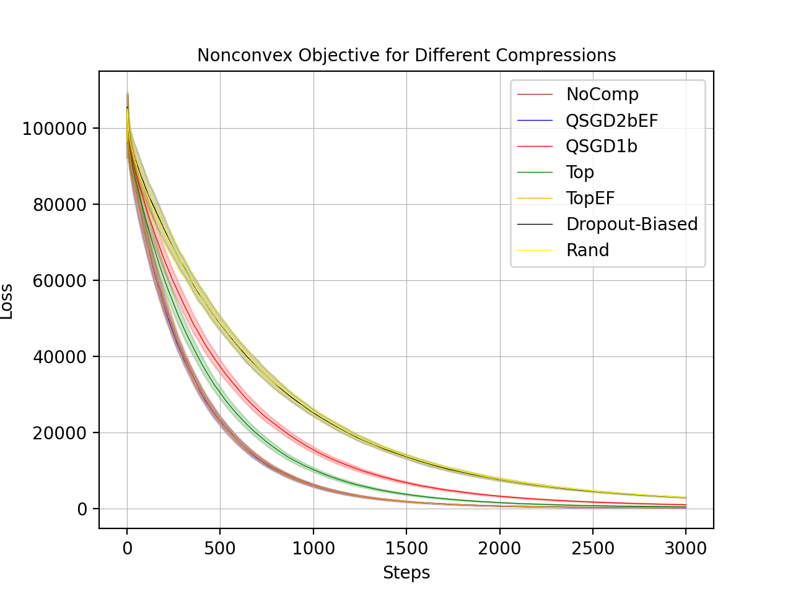

# Communication-Constrained Exchange of Zeroth-Order Information with Application to Collaborative Target Tracking

Authors: [Abolfazl Hashemi](https://abolfazlh.github.io/), Mehmet Berk Şahin, Ege Can Kaya 

## Abstract

In this paper, we study a communication-constrained multi-agent zeroth-order online optimization problem within the federated learning (FL) setting with application to target tracking where multiple agents have access only to the knowledge of their current distances to their respective targets. The agents additionally aim to avoid collisions by maintaining a minimum safe distance from their peers. Leveraging FL, the coordination among the agents as well as the  dissemination of the collision-prevention information to the agents is handled by a central server. To cope with the inherent communication limitations of the agents, we further leverage a feedback-based compression scheme in the agent-to-server communications where we compress/quantize a judiciously designed zeroth-order gradient estimator. We provide a theoretical analysis of the resulting algorithm. Our result features requiring  less restrictive assumptions compared to the prior work and carefully characterizing the impact of such relaxations on the convergence error. Finally, we numerically analyze the performance of the proposed algorithmic solution with regard to the tracking errors and collisions between agents.

 


## How do I run the code? 

A. Install our repo 

```
git clone https://github.com/Sunses-hub/EF_ZO_SGD.git
```
B. Go to EF_ZO_SGD directory to run the experiments. 

## Experiment 1 

